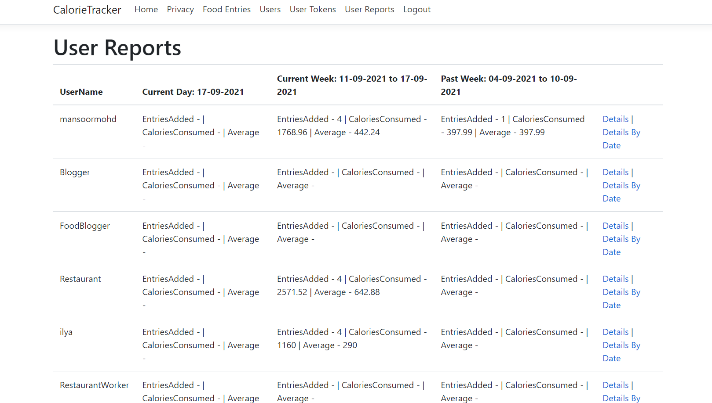

# Calorie App

Application to track calories consumed by users.

## Technologies Used:

- C# ASP.NET Core 3.1
- Database: SQL Server
- UI: Razor Pages with Bootstrap, Native Javascript, Jquery, Html and Css

## Libraries Used:
## Backend:
 1. Entity Framework - Framework that helps developers to work with database objects
 2. Automapper - Object to Object mapping library that easies developers to overcome manual mappings we do when we map objects
3. Swagger - API Documentation

## Frontend:
1. ASP.NET MVC Razor Pages
2. Bootstrap - Material UI and Jquery

## Video Links
- Web App
- 
- Api 
- 

## Quick Overview of features
The app currently supports two different types of user roles:
- Regular User
- Admin User (Admin Users have support to some additional features on top of what regular users have access to)

## Regular Users

- Login/Logout(Currently we support logging and logging out is purely based on username and a token is generated to authenticate the user as soon as he logs in)
- Food Entries (Actions Supported - Created, Edit, View and Delete)

- Reports (Dynamic Report that gives a quick overview of where they have reached daily calories limit, calories consumed, average calories consumed and number of food entries added

## Admin Users

In addition to the features available for regular users, admin can perform the following actions as well
- Edit Calorie Limit on Users and make them admin

- View Details of all the users

- View Details of Users tokens generated and Refresh or delete them if required

- Report generated against all the users

